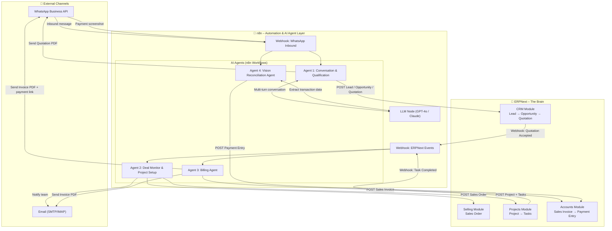
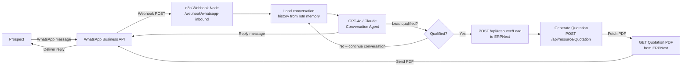
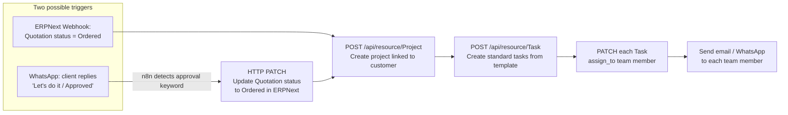
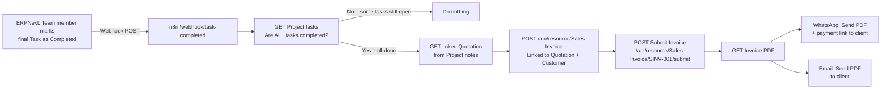
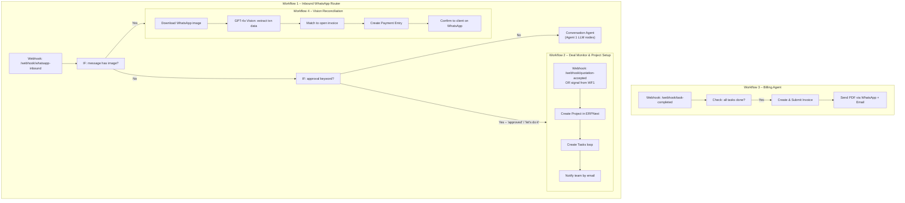
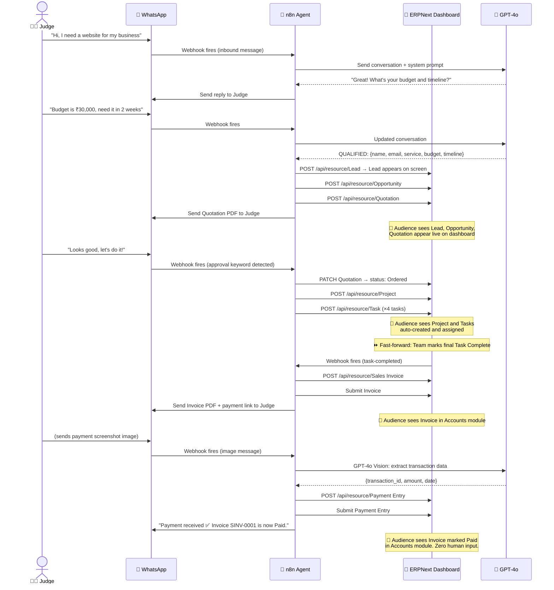

# 📁 Design Document – Autonomous CRM System
> **Tagline:** ERPNext as the Brain. n8n as the Hands. Zero human overhead.

---

## Table of Contents
1. [Project Overview](#1-project-overview)
2. [Tech Stack](#2-tech-stack)
3. [High-Level System Architecture](#3-high-level-system-architecture)
4. [ERPNext Setup & Configuration](#4-erpnext-setup--configuration)
5. [Phase 1 – Autonomous CRM (Acquisition)](#5-phase-1--autonomous-crm-acquisition)
6. [Phase 2 – Autonomous Work Management (Execution)](#6-phase-2--autonomous-work-management-execution)
7. [Phase 3 – Autonomous Invoicing (Billing)](#7-phase-3--autonomous-invoicing-billing)
8. [Phase 4 – Autonomous Reconciliation (Closing the Loop)](#8-phase-4--autonomous-reconciliation-closing-the-loop)
9. [n8n Workflow Configurations](#9-n8n-workflow-configurations)
10. [ERPNext REST API Reference](#10-erpnext-rest-api-reference)
11. [WhatsApp Integration](#11-whatsapp-integration)
12. [End-to-End Demo Flow](#12-end-to-end-demo-flow)

---

## 1. Project Overview

This system transforms ERPNext from a passive database into an **active, autonomous business engine**. Using n8n as the automation and AI-agent layer, the system handles the full customer lifecycle — from the first WhatsApp message to the final payment reconciliation — without a human ever touching a keyboard.

### Core Value Proposition
- **Eliminate 90%** of manual administrative overhead
- **Zero lead leakage** — every inbound message is captured
- **24/7 responsiveness** — the system never sleeps

### What Gets Automated

| Phase | What It Replaces |
|---|---|
| Phase 1 – Acquisition | Sales executive manually qualifying leads and creating CRM records |
| Phase 2 – Execution | Project manager setting up projects and assigning tasks |
| Phase 3 – Billing | Accountant generating and sending invoices |
| Phase 4 – Reconciliation | Accountant verifying payment screenshots and updating ledgers |

---

## 2. Tech Stack

| Layer | Tool | Purpose |
|---|---|---|
| ERP / Database | ERPNext (Docker) | Central source of truth for all business data |
| Automation / AI Agent | n8n (self-hosted) | Orchestrates all workflows, calls AI, calls ERPNext API |
| AI Model | OpenAI GPT-4o / Claude | Powers conversation, qualification, and vision agents |
| WhatsApp Channel | Meta WhatsApp Business API (or WATI) | Inbound and outbound messaging |
| Email Channel | SMTP (Gmail / SendGrid) | Sending invoices and notifications |
| Webhook Receiver | n8n built-in Webhook node | Receives events from ERPNext and WhatsApp |

---

## 3. High-Level System Architecture



---

## 4. ERPNext Setup & Configuration

### 4.1 Docker Setup (Already Done)
Your ERPNext is running. Confirm it is accessible at:
```
http://localhost:8080
```

### 4.2 Generate API Key (Required for all agent API calls)

1. Go to **ERPNext → Settings → Users**
2. Open your Administrator user
3. Scroll to **API Access** section
4. Click **Generate Keys**
5. Save the `api_key` and `api_secret` — you will use these in every n8n HTTP request

All API calls use this header:
```
Authorization: token <api_key>:<api_secret>
```

### 4.3 Configure Webhooks in ERPNext

You need to set up 3 webhooks so ERPNext notifies n8n when something changes.

Go to **ERPNext → Integrations → Webhooks → New**

#### Webhook 1 – Quotation Accepted
| Field | Value |
|---|---|
| DocType | Quotation |
| Webhook Trigger | on_update |
| Condition | `doc.status == "Ordered"` |
| Request URL | `http://<your-n8n-host>:5678/webhook/quotation-accepted` |
| Request Method | POST |

#### Webhook 2 – Task Completed
| Field | Value |
|---|---|
| DocType | Task |
| Webhook Trigger | on_update |
| Condition | `doc.status == "Completed"` |
| Request URL | `http://<your-n8n-host>:5678/webhook/task-completed` |
| Request Method | POST |

#### Webhook 3 – Invoice Submitted
| Field | Value |
|---|---|
| DocType | Sales Invoice |
| Webhook Trigger | on_submit |
| Condition | *(leave empty — fire on every submit)* |
| Request URL | `http://<your-n8n-host>:5678/webhook/invoice-submitted` |
| Request Method | POST |

### 4.4 Modules to Enable in ERPNext

Go to **ERPNext → ERPNext Settings → Modules** and make sure these are enabled:

- ✅ CRM
- ✅ Selling
- ✅ Projects
- ✅ Accounting

Everything else (Buying, Stock, Manufacturing, Assets) can be disabled for this project.

### 4.5 Pre-create Required Masters

Before the agents can create records, these master records must exist in ERPNext:

**Customer Group:** Go to CRM → Customer Group → Create "General"

**Territory:** Go to CRM → Territory → Create "All Territories"

**Item (your service):** Go to Stock → Item → Create one item per service type you offer. Example:
```
Item Code: WEB-DESIGN-BASIC
Item Name: Website Design – Basic Package
Item Group: Services
Rate: 25000
```

**Tax Template:** Go to Accounting → Tax Templates → Create your GST or applicable tax template

**Project Template (optional but recommended):** Go to Projects → Project Template → Create templates with standard tasks per service type. The agent will use these to auto-generate tasks.

---

## 5. Phase 1 – Autonomous CRM (Acquisition)

### 5.1 What This Phase Does

A prospect sends a WhatsApp message. The AI agent holds a conversation, qualifies the lead, and automatically creates the CRM records in ERPNext — no human involved.

### 5.2 Flow Diagram



### 5.3 n8n Workflow: Agent 1 – Conversation & Qualification

**Nodes in order:**

1. **Webhook node** — listens at `/webhook/whatsapp-inbound`
   - Receives: `{ from, body, messageId, timestamp }`

2. **Function node** — extract sender phone number and message text from WhatsApp payload

3. **n8n Memory / Redis node** — load the conversation history for this phone number (keyed by `from`)

4. **OpenAI / Claude node (Chat Model)** — send system prompt + conversation history + new message
   - System prompt defines the agent persona and qualification criteria (see Section 5.4)
   - Output: AI reply text + optional structured JSON if lead is qualified

5. **IF node** — check if AI output contains a `QUALIFIED: true` signal

6. **Branch A (Not qualified yet):**
   - Save updated conversation history to memory
   - Send AI reply back via WhatsApp API

7. **Branch B (Qualified):**
   - **HTTP Request node** → `POST /api/resource/Lead` to ERPNext
   - **HTTP Request node** → `POST /api/resource/Opportunity` (convert lead)
   - **HTTP Request node** → `POST /api/resource/Quotation`
   - **HTTP Request node** → `GET /api/method/frappe.utils.print_format.download_pdf?doctype=Quotation&name=QTN-0001` to fetch PDF
   - **WhatsApp node** → send PDF to prospect

### 5.4 AI System Prompt for Agent 1

```
You are a professional sales assistant for [Company Name]. Your job is to qualify
incoming leads on WhatsApp.

Your goal is to collect the following information through natural conversation:
1. What service they are looking for
2. Their approximate budget
3. Their timeline (when they need it)
4. Their name and email

Rules:
- Be friendly, professional, and concise
- Ask one question at a time
- Do not mention internal systems or ERPNext
- Once you have all 4 pieces of information, end your message with this exact JSON block:
  QUALIFIED: {"name": "", "email": "", "service": "", "budget": "", "timeline": ""}
- Until you have all info, just continue the conversation naturally
```

### 5.5 ERPNext API Calls for Phase 1

**Create Lead:**
```http
POST http://localhost:8080/api/resource/Lead
Authorization: token api_key:api_secret
Content-Type: application/json

{
  "lead_name": "Rahul Sharma",
  "email_id": "rahul@example.com",
  "mobile_no": "+919876543210",
  "lead_owner": "Administrator",
  "status": "Open",
  "source": "WhatsApp",
  "notes": "Looking for website design, budget ₹25000, timeline 2 weeks"
}
```

**Convert Lead to Opportunity:**
```http
POST http://localhost:8080/api/resource/Opportunity
Authorization: token api_key:api_secret
Content-Type: application/json

{
  "opportunity_from": "Lead",
  "party_name": "LEAD-00001",
  "opportunity_type": "Sales",
  "status": "Open",
  "expected_closing": "2025-06-30"
}
```

**Create Quotation:**
```http
POST http://localhost:8080/api/resource/Quotation
Authorization: token api_key:api_secret
Content-Type: application/json

{
  "quotation_to": "Lead",
  "party_name": "LEAD-00001",
  "items": [
    {
      "item_code": "WEB-DESIGN-BASIC",
      "qty": 1,
      "rate": 25000
    }
  ],
  "taxes_and_charges": "GST 18%"
}
```

**Fetch Quotation PDF:**
```http
GET http://localhost:8080/api/method/frappe.utils.print_format.download_pdf
  ?doctype=Quotation
  &name=QTN-0001
  &format=Standard
Authorization: token api_key:api_secret
```

---

## 6. Phase 2 – Autonomous Work Management (Execution)

### 6.1 What This Phase Does

When the client approves the quotation (replies "yes" or "let's do it" on WhatsApp, or ERPNext status changes), the agent automatically creates a Project with Tasks and assigns them to team members.

### 6.2 Flow Diagram



### 6.3 n8n Workflow: Agent 2 – Deal Monitor & Project Setup

**Nodes in order:**

1. **Webhook node** — listens at `/webhook/quotation-accepted` (fired by ERPNext webhook configured in Section 4.3)
   - Also: **Webhook node** at `/webhook/whatsapp-inbound` — if the message contains approval keywords, route here

2. **HTTP Request node** — `GET /api/resource/Quotation/<name>` to fetch full quotation details (customer name, items, linked lead)

3. **HTTP Request node** — `POST /api/resource/Project` to create the project

4. **Function node** — based on the service type in the quotation items, define the list of standard tasks

5. **Loop node** — for each task in the list:
   - **HTTP Request node** → `POST /api/resource/Task`

6. **HTTP Request node** — fetch the team member's email from ERPNext Users

7. **Email node** — notify each assigned team member

8. **WhatsApp node** — send confirmation to the client: "Your project has been created. Our team will begin work shortly."

### 6.4 ERPNext API Calls for Phase 2

**Create Project:**
```http
POST http://localhost:8080/api/resource/Project
Authorization: token api_key:api_secret
Content-Type: application/json

{
  "project_name": "Website Design – Rahul Sharma",
  "status": "Open",
  "expected_start_date": "2025-06-01",
  "expected_end_date": "2025-06-15",
  "customer": "Rahul Sharma",
  "notes": "Sourced via WhatsApp. Quotation QTN-0001."
}
```

**Create Task (repeat for each task):**
```http
POST http://localhost:8080/api/resource/Task
Authorization: token api_key:api_secret
Content-Type: application/json

{
  "subject": "UI Wireframes",
  "project": "Website Design – Rahul Sharma",
  "status": "Open",
  "assigned_to": "developer@yourcompany.com",
  "expected_time": 8,
  "description": "Create wireframes for all 5 pages"
}
```

**Standard Task Templates by Service Type** (define this as a Function node in n8n):
```json
{
  "WEB-DESIGN-BASIC": [
    "Requirements Gathering",
    "UI Wireframes",
    "Design Mockups",
    "Development",
    "Testing & QA",
    "Deployment & Handover"
  ],
  "SEO-PACKAGE": [
    "Site Audit",
    "Keyword Research",
    "On-Page Optimization",
    "Report Delivery"
  ]
}
```

---

## 7. Phase 3 – Autonomous Invoicing (Billing)

### 7.1 What This Phase Does

When the team marks the final task as "Completed" inside ERPNext, the agent automatically generates a Sales Invoice and sends it to the client with a payment link.

### 7.2 Flow Diagram



### 7.3 n8n Workflow: Agent 3 – Billing Agent

**Nodes in order:**

1. **Webhook node** — listens at `/webhook/task-completed`

2. **HTTP Request node** — `GET /api/resource/Task?filters=[["project","=","<project_name>"]]` — fetch all tasks for this project

3. **Function node** — check if every task has `status == "Completed"`. If not, stop the workflow.

4. **HTTP Request node** — fetch the original Quotation linked to the Project

5. **HTTP Request node** — `POST /api/resource/Sales Invoice` — create invoice copying items from Quotation

6. **HTTP Request node** — `POST /api/resource/Sales Invoice/<name>/submit` — submit (finalize) the invoice in ERPNext

7. **HTTP Request node** — fetch the Invoice PDF

8. **WhatsApp node** — send PDF + payment link to client

9. **Email node** — send same PDF to client email

### 7.4 ERPNext API Calls for Phase 3

**Create Sales Invoice:**
```http
POST http://localhost:8080/api/resource/Sales Invoice
Authorization: token api_key:api_secret
Content-Type: application/json

{
  "customer": "Rahul Sharma",
  "due_date": "2025-07-01",
  "items": [
    {
      "item_code": "WEB-DESIGN-BASIC",
      "qty": 1,
      "rate": 25000
    }
  ],
  "taxes_and_charges": "GST 18%",
  "remarks": "Against Quotation QTN-0001. Project: Website Design – Rahul Sharma."
}
```

**Submit Invoice (make it official):**
```http
POST http://localhost:8080/api/resource/Sales Invoice/SINV-0001/submit
Authorization: token api_key:api_secret
```

**Get Invoice PDF:**
```http
GET http://localhost:8080/api/method/frappe.utils.print_format.download_pdf
  ?doctype=Sales%20Invoice
  &name=SINV-0001
  &format=Standard
Authorization: token api_key:api_secret
```

---

## 8. Phase 4 – Autonomous Reconciliation (Closing the Loop)

### 8.1 What This Phase Does

The client sends a payment screenshot (bank transfer receipt) via WhatsApp. The Vision AI agent reads the image, extracts the transaction details, matches them to the open invoice, and marks it as Paid in ERPNext — no accountant needed.

### 8.2 Flow Diagram

```mermaid
flowchart LR
    P["Client"] -->|Sends payment\nscreenshot on WhatsApp| WA["WhatsApp"]
    WA -->|Webhook with image URL| N8N["n8n /webhook/whatsapp-inbound"]
    N8N --> DETECT["Detect: is this an image\n+ payment context?"]
    DETECT -->|Not a payment image| IGNORE["Route to Agent 1\n(normal conversation)"]
    DETECT -->|Yes| DOWNLOAD["Download image\nfrom WhatsApp media URL"]
    DOWNLOAD --> VISION["GPT-4o Vision / Claude\nExtract: txn_id, amount,\ndate, sender name"]
    VISION --> MATCH["GET /api/resource/Sales Invoice\nFind open invoice matching amount"]
    MATCH --> PAYMENT["POST /api/resource/Payment Entry\nCreate payment linked to invoice"]
    PAYMENT --> SUBMIT["Submit Payment Entry"]
    SUBMIT --> CONFIRM["WhatsApp: Send confirmation\n'Payment received. Invoice closed.'"]
```



### 8.3 n8n Workflow: Agent 4 – Vision Reconciliation Agent

**Nodes in order:**

1. **Webhook node** — at `/webhook/whatsapp-inbound` — shared entry point with Agent 1

2. **IF node** — check if the incoming message has `type == "image"`. If not, route to Agent 1.

3. **HTTP Request node** — download the image from WhatsApp's media URL using the WhatsApp API

4. **OpenAI Vision node (or HTTP Request to Claude API)** — send the image with this prompt:

```
You are a payment verification assistant. Extract the following fields from
this payment receipt image and return ONLY valid JSON, nothing else:
{
  "transaction_id": "",
  "amount": 0,
  "currency": "",
  "date": "",
  "sender_name": "",
  "receiver_name": "",
  "bank_name": ""
}
If any field is not visible, use null.
```

5. **Function node** — parse the JSON response from the vision model

6. **HTTP Request node** — `GET /api/resource/Sales Invoice` with filter on `outstanding_amount == extracted_amount` to find the matching invoice

7. **IF node** — verify the amount matches. If no match found, send a WhatsApp message asking for clarification.

8. **HTTP Request node** — `POST /api/resource/Payment Entry` to record the payment

9. **HTTP Request node** — `POST /api/resource/Payment Entry/<name>/submit` to finalize

10. **WhatsApp node** — send confirmation to client

### 8.4 ERPNext API Calls for Phase 4

**Find Matching Open Invoice:**
```http
GET http://localhost:8080/api/resource/Sales Invoice
  ?filters=[["outstanding_amount","=",25000],["status","=","Unpaid"]]
  &fields=["name","customer","grand_total","outstanding_amount"]
Authorization: token api_key:api_secret
```

**Create Payment Entry:**
```http
POST http://localhost:8080/api/resource/Payment Entry
Authorization: token api_key:api_secret
Content-Type: application/json

{
  "payment_type": "Receive",
  "party_type": "Customer",
  "party": "Rahul Sharma",
  "paid_amount": 29500,
  "received_amount": 29500,
  "paid_from": "Debtors - Company",
  "paid_to": "Cash - Company",
  "reference_no": "TXN123456789",
  "reference_date": "2025-06-01",
  "remarks": "Payment verified via WhatsApp screenshot by AI Vision Agent",
  "references": [
    {
      "reference_doctype": "Sales Invoice",
      "reference_name": "SINV-0001",
      "allocated_amount": 29500
    }
  ]
}
```

**Submit Payment Entry:**
```http
POST http://localhost:8080/api/resource/Payment Entry/PE-0001/submit
Authorization: token api_key:api_secret
```

---

## 9. n8n Workflow Configurations

### 9.1 Install n8n locally

```bash
docker run -d \
  --name n8n \
  -p 5678:5678 \
  -v n8n_data:/home/node/.n8n \
  n8nio/n8n
```

Access at: `http://localhost:5678`

### 9.2 Credentials to Configure in n8n

Go to **n8n → Settings → Credentials** and add:

| Credential Name | Type | What to fill |
|---|---|---|
| ERPNext API | HTTP Header Auth | `Authorization: token <api_key>:<api_secret>` |
| OpenAI | OpenAI API | Your OpenAI API key |
| WhatsApp Business | HTTP Header Auth | `Authorization: Bearer <whatsapp_token>` |
| Gmail / SMTP | SMTP | Your email credentials |

### 9.3 Overview of All n8n Workflows



### 9.4 n8n Memory Strategy for Multi-turn Conversations

Since Agent 1 needs to remember what was said earlier in the WhatsApp conversation, use n8n's built-in **Window Buffer Memory** node or store state in a simple key-value store:

- Key: `whatsapp_session_<phone_number>`
- Value: JSON array of `{ role, content }` messages
- Store in: n8n's built-in static data or a Redis node (recommended for production)

Clear the session when:
- Lead is qualified and created in ERPNext
- The user has been inactive for 24 hours

---

## 10. ERPNext REST API Reference

### Base URL
```
http://localhost:8080
```

### Authentication Header
```
Authorization: token <api_key>:<api_secret>
```

### Quick Reference Table

| Operation | Method | Endpoint |
|---|---|---|
| Create Lead | POST | `/api/resource/Lead` |
| Get Lead | GET | `/api/resource/Lead/<name>` |
| Update Lead | PUT | `/api/resource/Lead/<name>` |
| Create Opportunity | POST | `/api/resource/Opportunity` |
| Create Quotation | POST | `/api/resource/Quotation` |
| Submit Quotation | POST | `/api/resource/Quotation/<name>/submit` |
| Get Quotation PDF | GET | `/api/method/frappe.utils.print_format.download_pdf?doctype=Quotation&name=<name>` |
| Create Project | POST | `/api/resource/Project` |
| Create Task | POST | `/api/resource/Task` |
| Update Task status | PUT | `/api/resource/Task/<name>` |
| Get all Tasks for Project | GET | `/api/resource/Task?filters=[["project","=","<name>"]]` |
| Create Sales Invoice | POST | `/api/resource/Sales Invoice` |
| Submit Sales Invoice | POST | `/api/resource/Sales Invoice/<name>/submit` |
| Get Invoice PDF | GET | `/api/method/frappe.utils.print_format.download_pdf?doctype=Sales%20Invoice&name=<name>` |
| Find Open Invoices | GET | `/api/resource/Sales Invoice?filters=[["status","=","Unpaid"]]` |
| Create Payment Entry | POST | `/api/resource/Payment Entry` |
| Submit Payment Entry | POST | `/api/resource/Payment Entry/<name>/submit` |
| List all Webhooks | GET | `/api/resource/Webhook` |

---

## 11. WhatsApp Integration

### Option A – Meta WhatsApp Business Cloud API (Recommended for Hackathon)
Free to use. You get a test number immediately from Meta.

1. Go to [developers.facebook.com](https://developers.facebook.com)
2. Create a new App → Business type
3. Add WhatsApp product
4. Go to **WhatsApp → Getting Started** — copy your test phone number and access token
5. Set your Webhook URL to: `http://<your-public-url>/webhook/whatsapp-inbound`
6. For local development, expose n8n using: `ngrok http 5678`
7. Your webhook verify token: set any random string in Meta and match it in n8n

**Receiving a message payload from Meta:**
```json
{
  "entry": [{
    "changes": [{
      "value": {
        "messages": [{
          "from": "919876543210",
          "type": "text",
          "text": { "body": "Hi, I need a website" },
          "id": "wamid.xxx"
        }]
      }
    }]
  }]
}
```

**Sending a message via Meta API:**
```http
POST https://graph.facebook.com/v18.0/<phone_number_id>/messages
Authorization: Bearer <whatsapp_token>
Content-Type: application/json

{
  "messaging_product": "whatsapp",
  "to": "919876543210",
  "type": "text",
  "text": { "body": "Hello! I am your AI assistant. How can I help you today?" }
}
```

**Sending a document (PDF invoice/quotation):**
```http
POST https://graph.facebook.com/v18.0/<phone_number_id>/messages
Authorization: Bearer <whatsapp_token>
Content-Type: application/json

{
  "messaging_product": "whatsapp",
  "to": "919876543210",
  "type": "document",
  "document": {
    "url": "https://yourserver.com/invoice.pdf",
    "filename": "Invoice-SINV-0001.pdf",
    "caption": "Your invoice is attached. Please pay by June 30."
  }
}
```

### Option B – WATI (Simpler, No-Code Setup)
WATI is a WhatsApp Business API provider with a built-in n8n integration. Easier for hackathon but has a free trial limit.

---

## 12. End-to-End Demo Flow

This is the exact sequence to run at the hackathon. Practice this flow until it takes under 5 minutes.



### Demo Checklist Before Going on Stage

- [ ] ERPNext is running and accessible at localhost:8080
- [ ] n8n is running and all 4 workflows are active
- [ ] ngrok tunnel is running and WhatsApp webhook URL is updated in Meta dashboard
- [ ] A test phone number is ready and connected to the WhatsApp Business API
- [ ] ERPNext dashboard is open on the big screen, showing CRM → Lead list
- [ ] Item master (WEB-DESIGN-BASIC) is pre-created in ERPNext
- [ ] Tax template is configured in ERPNext
- [ ] A team member user is created in ERPNext for task assignment
- [ ] A fake payment screenshot is ready on the judge's phone to send in Phase 4
- [ ] All n8n credentials (ERPNext API key, OpenAI key, WhatsApp token) are configured

---

*End of Design Document*
