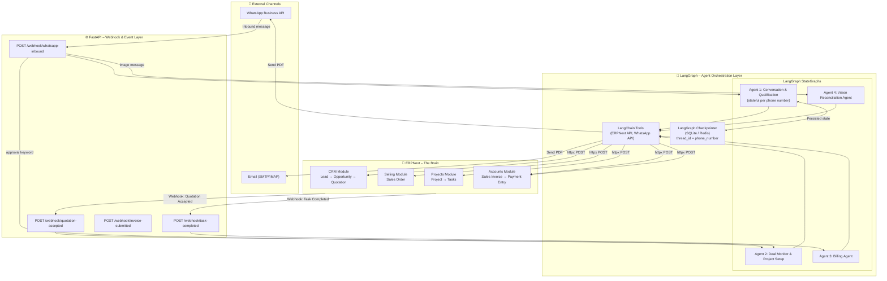
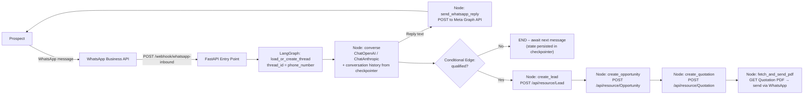
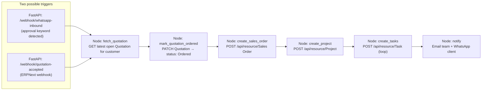
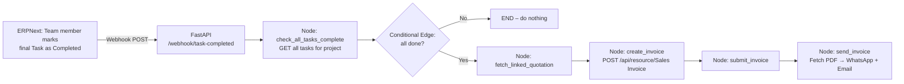
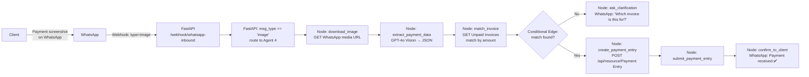
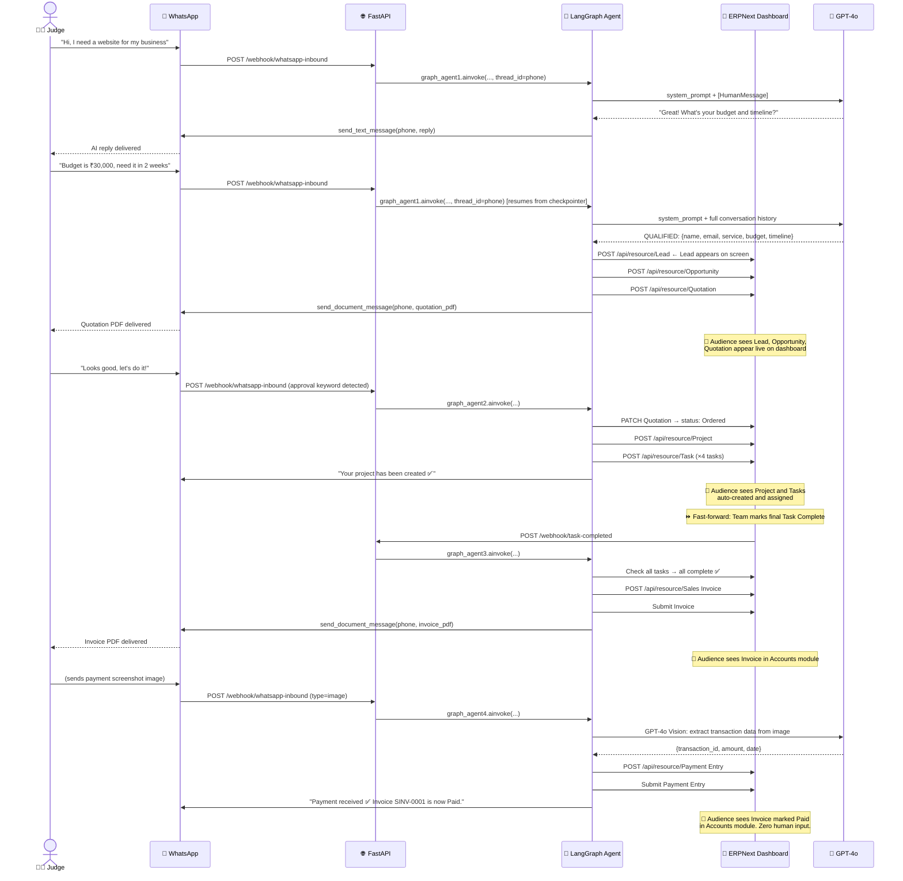

# 📁 Design Document – Autonomous CRM System
> **Tagline:** ERPNext as the Brain. LangGraph as the Hands. Zero human overhead.

---

## Table of Contents
1. [Project Overview](#1-project-overview)
2. [Tech Stack](#2-tech-stack)
3. [High-Level System Architecture](#3-high-level-system-architecture)
4. [ERPNext Setup & Configuration](#4-erpnext-setup--configuration)
5. [Phase 1 – Autonomous CRM (Acquisition)](#5-phase-1--autonomous-crm-acquisition)
6. [Phase 2 – Autonomous Work Management (Execution)](#6-phase-2--autonomous-work-management-execution)
7. [Phase 3 – Autonomous Invoicing (Billing)](#7-phase-3--autonomous-invoicing-billing)
8. [Phase 4 – Autonomous Reconciliation (Closing the Loop)](#8-phase-4--autonomous-reconciliation-closing-the-loop)
9. [LangGraph Agent Architecture](#9-langgraph-agent-architecture)
10. [ERPNext REST API Reference](#10-erpnext-rest-api-reference)
11. [WhatsApp Integration](#11-whatsapp-integration)
12. [End-to-End Demo Flow](#12-end-to-end-demo-flow)

---

## 1. Project Overview

This system transforms ERPNext from a passive database into an **active, autonomous business engine**. Using LangGraph + LangChain as the AI-agent orchestration layer (served via FastAPI), the system handles the full customer lifecycle — from the first WhatsApp message to the final payment reconciliation — without a human ever touching a keyboard.

### Core Value Proposition
- **Eliminate 90%** of manual administrative overhead
- **Zero lead leakage** — every inbound message is captured
- **24/7 responsiveness** — the system never sleeps

### What Gets Automated

| Phase | What It Replaces |
|---|---|
| Phase 1 – Acquisition | Sales executive manually qualifying leads and creating CRM records |
| Phase 2 – Execution | Project manager setting up projects and assigning tasks |
| Phase 3 – Billing | Accountant generating and sending invoices |
| Phase 4 – Reconciliation | Accountant verifying payment screenshots and updating ledgers |

---

## 2. Tech Stack

| Layer | Tool | Purpose |
|---|---|---|
| ERP / Database | ERPNext (Docker) | Central source of truth for all business data |
| Agent Orchestration | LangGraph | Stateful multi-agent graph execution with branching and cycles |
| Agent Framework | LangChain | LLM abstraction, tool definitions, prompt templates |
| Agent Server | FastAPI (Python) | Receives webhooks, triggers graphs, exposes health endpoints |
| AI Model | OpenAI GPT-4o / Claude Sonnet | Powers conversation, qualification, and vision agents |
| State Persistence | LangGraph Checkpointer (SQLite / Redis) | Multi-turn WhatsApp conversation memory per phone number |
| HTTP Client | `httpx` (async) | All ERPNext REST API calls from within agent nodes |
| WhatsApp Channel | Meta WhatsApp Business API (or WATI) | Inbound and outbound messaging |
| Email Channel | SMTP (Gmail / SendGrid) | Sending invoices and notifications |

### Project Structure

```
erp-agent/
├── main.py                  # FastAPI app — webhook endpoints
├── agents/
│   ├── agent1_crm.py        # LangGraph graph: Conversation & Qualification
│   ├── agent2_projects.py   # LangGraph graph: Deal Monitor & Project Setup
│   ├── agent3_billing.py    # LangGraph graph: Billing Agent
│   └── agent4_vision.py     # LangGraph graph: Vision Reconciliation
├── tools/
│   ├── erpnext.py           # LangChain tools wrapping ERPNext REST API
│   └── whatsapp.py          # LangChain tools for sending WhatsApp messages
├── state/
│   └── schemas.py           # TypedDict state definitions for each graph
├── checkpointer.py          # Shared SQLite / Redis checkpointer setup
└── config.py                # API keys, base URLs, env vars
```

---

## 3. High-Level System Architecture



---

## 4. ERPNext Setup & Configuration

### 4.1 Docker Setup (Already Done)
Your ERPNext is running. Confirm it is accessible at:
```
http://localhost:8080
```

### 4.2 Generate API Key (Required for all agent API calls)

1. Go to **ERPNext → Settings → Users**
2. Open your Administrator user
3. Scroll to **API Access** section
4. Click **Generate Keys**
5. Save the `api_key` and `api_secret` — you will put these in your `.env` file

All API calls use this header:
```
Authorization: token <api_key>:<api_secret>
```

Store in `.env`:
```env
ERPNEXT_BASE_URL=http://localhost:8080
ERPNEXT_API_KEY=your_api_key
ERPNEXT_API_SECRET=your_api_secret
OPENAI_API_KEY=sk-...
WHATSAPP_TOKEN=your_whatsapp_bearer_token
WHATSAPP_PHONE_NUMBER_ID=your_phone_number_id
```

### 4.3 Configure Webhooks in ERPNext

You need to set up 3 webhooks so ERPNext notifies the FastAPI server when something changes.

Go to **ERPNext → Integrations → Webhooks → New**

#### Webhook 1 – Quotation Accepted
| Field | Value |
|---|---|
| DocType | Quotation |
| Webhook Trigger | on_update |
| Condition | `doc.status == "Ordered"` |
| Request URL | `http://<your-fastapi-host>:8000/webhook/quotation-accepted` |
| Request Method | POST |

#### Webhook 2 – Task Completed
| Field | Value |
|---|---|
| DocType | Task |
| Webhook Trigger | on_update |
| Condition | `doc.status == "Completed"` |
| Request URL | `http://<your-fastapi-host>:8000/webhook/task-completed` |
| Request Method | POST |

#### Webhook 3 – Invoice Submitted
| Field | Value |
|---|---|
| DocType | Sales Invoice |
| Webhook Trigger | on_submit |
| Condition | *(leave empty — fire on every submit)* |
| Request URL | `http://<your-fastapi-host>:8000/webhook/invoice-submitted` |
| Request Method | POST |

### 4.4 Modules to Enable in ERPNext

Go to **ERPNext → ERPNext Settings → Modules** and make sure these are enabled:

- ✅ CRM
- ✅ Selling
- ✅ Projects
- ✅ Accounting

Everything else (Buying, Stock, Manufacturing, Assets) can be disabled for this project.

### 4.5 Pre-create Required Masters

Before the agents can create records, these master records must exist in ERPNext:

**Customer Group:** Go to CRM → Customer Group → Create "General"

**Territory:** Go to CRM → Territory → Create "All Territories"

**Item (your service):** Go to Stock → Item → Create one item per service type you offer. Example:
```
Item Code: WEB-DESIGN-BASIC
Item Name: Website Design – Basic Package
Item Group: Services
Rate: 25000
```

**Tax Template:** Go to Accounting → Tax Templates → Create your GST or applicable tax template

**Project Template (optional but recommended):** Go to Projects → Project Template → Create templates with standard tasks per service type. The agent will use these to auto-generate tasks.

---

## 5. Phase 1 – Autonomous CRM (Acquisition)

### 5.1 What This Phase Does

A prospect sends a WhatsApp message. The LangGraph Conversation Agent holds a stateful multi-turn conversation (memory persisted in the checkpointer, keyed by the sender's phone number), qualifies the lead, and automatically creates the CRM records in ERPNext — no human involved.

### 5.2 Flow Diagram



### 5.3 LangGraph Agent: Agent 1 – Conversation & Qualification

**State schema** (`state/schemas.py`):
```python
from typing import TypedDict, Optional, Annotated
from langgraph.graph.message import add_messages

class Agent1State(TypedDict):
    messages: Annotated[list, add_messages]   # full conversation history
    phone: str                                 # sender's phone number
    qualified: bool
    lead_data: Optional[dict]                  # extracted: name, email, service, budget, timeline
```

**Graph definition** (`agents/agent1_crm.py`):
```python
from langgraph.graph import StateGraph, END
from langchain_openai import ChatOpenAI
from langchain_core.messages import SystemMessage, HumanMessage
from tools.erpnext import create_lead, create_opportunity, create_quotation, fetch_quotation_pdf
from tools.whatsapp import send_text_message, send_document_message
import json

llm = ChatOpenAI(model="gpt-4o", temperature=0.3)

SYSTEM_PROMPT = """
You are a professional sales assistant for [Company Name]. Your job is to qualify
incoming leads over WhatsApp.

Your goal is to collect the following through natural conversation:
1. What service they are looking for
2. Their approximate budget
3. Their timeline (when they need it)
4. Their name and email

Rules:
- Be friendly, professional, and concise
- Ask one question at a time
- Do not mention internal systems or ERPNext
- Once you have ALL 4 pieces of information, end your message with exactly this JSON block:
  QUALIFIED: {"name": "", "email": "", "service": "", "budget": "", "timeline": ""}
- Until you have all info, continue the conversation naturally
"""

def converse(state: Agent1State) -> Agent1State:
    response = llm.invoke([SystemMessage(content=SYSTEM_PROMPT)] + state["messages"])
    content = response.content

    # Check if the LLM has signalled qualification
    if "QUALIFIED:" in content:
        json_str = content.split("QUALIFIED:")[1].strip()
        lead_data = json.loads(json_str)
        reply_text = content.split("QUALIFIED:")[0].strip()
        return {
            "messages": [response],
            "qualified": True,
            "lead_data": lead_data,
        }

    send_text_message(state["phone"], content)
    return {"messages": [response], "qualified": False}


def create_crm_records(state: Agent1State) -> Agent1State:
    d = state["lead_data"]
    lead = create_lead(d["name"], state["phone"], d["email"], d["service"], d["budget"], d["timeline"])
    opp  = create_opportunity(lead["name"])
    quote = create_quotation(lead["name"], d["service"])
    pdf_bytes = fetch_quotation_pdf(quote["name"])
    send_document_message(state["phone"], pdf_bytes, f"Quotation-{quote['name']}.pdf")
    return {}


def route_after_converse(state: Agent1State) -> str:
    return "create_crm" if state["qualified"] else END


# Build graph
builder = StateGraph(Agent1State)
builder.add_node("converse", converse)
builder.add_node("create_crm", create_crm_records)
builder.set_entry_point("converse")
builder.add_conditional_edges("converse", route_after_converse, {
    "create_crm": "create_crm",
    END: END,
})
builder.add_edge("create_crm", END)

graph_agent1 = builder.compile(checkpointer=get_checkpointer())
```

**FastAPI webhook handler** (`main.py`):
```python
@app.post("/webhook/whatsapp-inbound")
async def whatsapp_inbound(payload: dict):
    message = payload["entry"][0]["changes"][0]["value"]["messages"][0]
    phone   = message["from"]
    msg_type = message["type"]

    if msg_type == "image":
        await graph_agent4.ainvoke(
            {"phone": phone, "image_url": message["image"]["id"]},
            config={"configurable": {"thread_id": f"pay_{phone}"}}
        )
    elif msg_type == "text":
        body = message["text"]["body"]
        # Check for approval keyword → route to Agent 2
        if any(kw in body.lower() for kw in ["approved", "let's do it", "yes proceed", "confirm"]):
            await graph_agent2.ainvoke(
                {"phone": phone, "approval_message": body},
                config={"configurable": {"thread_id": f"deal_{phone}"}}
            )
        else:
            from langchain_core.messages import HumanMessage
            await graph_agent1.ainvoke(
                {"messages": [HumanMessage(content=body)], "phone": phone, "qualified": False},
                config={"configurable": {"thread_id": phone}}   # keyed by phone for memory
            )
    return {"status": "ok"}
```

### 5.4 ERPNext API Calls for Phase 1

All calls are made from `tools/erpnext.py` using `httpx`:

```python
import httpx, os

BASE  = os.getenv("ERPNEXT_BASE_URL")
HEADERS = {
    "Authorization": f"token {os.getenv('ERPNEXT_API_KEY')}:{os.getenv('ERPNEXT_API_SECRET')}",
    "Content-Type": "application/json"
}

def create_lead(name, phone, email, service, budget, timeline):
    r = httpx.post(f"{BASE}/api/resource/Lead", headers=HEADERS, json={
        "lead_name":  name,
        "email_id":   email,
        "mobile_no":  phone,
        "lead_owner": "Administrator",
        "status":     "Open",
        "source":     "WhatsApp",
        "notes":      f"Service: {service}, Budget: {budget}, Timeline: {timeline}"
    })
    return r.json()["data"]

def create_opportunity(lead_name):
    r = httpx.post(f"{BASE}/api/resource/Opportunity", headers=HEADERS, json={
        "opportunity_from": "Lead",
        "party_name":       lead_name,
        "opportunity_type": "Sales",
        "status":           "Open",
    })
    return r.json()["data"]

def create_quotation(lead_name, service_item):
    r = httpx.post(f"{BASE}/api/resource/Quotation", headers=HEADERS, json={
        "quotation_to": "Lead",
        "party_name":   lead_name,
        "items": [{"item_code": service_item, "qty": 1}],
        "taxes_and_charges": "GST 18%"
    })
    return r.json()["data"]

def fetch_quotation_pdf(quotation_name):
    r = httpx.get(
        f"{BASE}/api/method/frappe.utils.print_format.download_pdf",
        headers=HEADERS,
        params={"doctype": "Quotation", "name": quotation_name, "format": "Standard"}
    )
    return r.content  # bytes
```

---

## 6. Phase 2 – Autonomous Work Management (Execution)

### 6.1 What This Phase Does

When the client approves the quotation (either via WhatsApp keyword or the ERPNext Quotation webhook), Agent 2 automatically creates a Project with Tasks in ERPNext and notifies the team.

### 6.2 Flow Diagram



### 6.3 LangGraph Agent: Agent 2 – Deal Monitor & Project Setup

```python
from langgraph.graph import StateGraph, END
from typing import TypedDict, Optional

class Agent2State(TypedDict):
    phone:          str
    quotation_name: Optional[str]
    customer_name:  Optional[str]
    service_item:   Optional[str]
    project_name:   Optional[str]
    task_names:     list[str]

TASK_TEMPLATES = {
    "WEB-DESIGN-BASIC": [
        "Requirements Gathering",
        "UI Wireframes",
        "Design Mockups",
        "Development",
        "Testing & QA",
        "Deployment & Handover",
    ],
    "SEO-PACKAGE": [
        "Site Audit",
        "Keyword Research",
        "On-Page Optimization",
        "Report Delivery",
    ],
}

def fetch_quotation(state: Agent2State) -> Agent2State:
    # Fetch latest Ordered or Open quotation for this customer
    quote = get_latest_quotation_for_phone(state["phone"])
    return {
        "quotation_name": quote["name"],
        "customer_name":  quote["party_name"],
        "service_item":   quote["items"][0]["item_code"],
    }

def create_project(state: Agent2State) -> Agent2State:
    project = erpnext_create_project(state["customer_name"], state["quotation_name"])
    return {"project_name": project["name"]}

def create_tasks(state: Agent2State) -> Agent2State:
    tasks = TASK_TEMPLATES.get(state["service_item"], ["Discovery", "Delivery"])
    names = []
    for task_subject in tasks:
        t = erpnext_create_task(task_subject, state["project_name"])
        names.append(t["name"])
    return {"task_names": names}

def notify(state: Agent2State) -> Agent2State:
    send_text_message(
        state["phone"],
        f"✅ Your project *{state['project_name']}* has been created. "
        "Our team will begin work shortly."
    )
    send_team_email(state["project_name"])
    return {}

builder = StateGraph(Agent2State)
builder.add_node("fetch_quotation", fetch_quotation)
builder.add_node("create_project",  create_project)
builder.add_node("create_tasks",    create_tasks)
builder.add_node("notify",          notify)
builder.set_entry_point("fetch_quotation")
builder.add_edge("fetch_quotation", "create_project")
builder.add_edge("create_project",  "create_tasks")
builder.add_edge("create_tasks",    "notify")
builder.add_edge("notify",          END)

graph_agent2 = builder.compile()
```

### 6.4 ERPNext API Calls for Phase 2

**Create Project:**
```http
POST http://localhost:8080/api/resource/Project
Authorization: token api_key:api_secret
Content-Type: application/json

{
  "project_name": "Website Design – Rahul Sharma",
  "status": "Open",
  "expected_start_date": "2025-06-01",
  "expected_end_date": "2025-06-15",
  "customer": "Rahul Sharma",
  "notes": "Sourced via WhatsApp. Quotation QTN-0001."
}
```

**Create Task (repeat per task):**
```http
POST http://localhost:8080/api/resource/Task
Authorization: token api_key:api_secret
Content-Type: application/json

{
  "subject": "UI Wireframes",
  "project": "Website Design – Rahul Sharma",
  "status": "Open",
  "assigned_to": "developer@yourcompany.com",
  "expected_time": 8
}
```

---

## 7. Phase 3 – Autonomous Invoicing (Billing)

### 7.1 What This Phase Does

When the team marks the final task as "Completed" in ERPNext, Agent 3 checks whether all project tasks are done, and if so, generates a Sales Invoice and sends it to the client.

### 7.2 Flow Diagram



### 7.3 LangGraph Agent: Agent 3 – Billing Agent

```python
from langgraph.graph import StateGraph, END
from typing import TypedDict, Optional

class Agent3State(TypedDict):
    project_name:   str
    phone:          Optional[str]
    all_done:       bool
    quotation_name: Optional[str]
    invoice_name:   Optional[str]

def check_all_tasks_complete(state: Agent3State) -> Agent3State:
    tasks = erpnext_get_tasks_for_project(state["project_name"])
    all_done = all(t["status"] == "Completed" for t in tasks)
    return {"all_done": all_done}

def route_after_check(state: Agent3State) -> str:
    return "fetch_linked_quotation" if state["all_done"] else END

def fetch_linked_quotation(state: Agent3State) -> Agent3State:
    quote = erpnext_get_quotation_for_project(state["project_name"])
    return {"quotation_name": quote["name"]}

def create_invoice(state: Agent3State) -> Agent3State:
    invoice = erpnext_create_sales_invoice(state["project_name"], state["quotation_name"])
    erpnext_submit_document("Sales Invoice", invoice["name"])
    return {"invoice_name": invoice["name"]}

def send_invoice(state: Agent3State) -> Agent3State:
    pdf = fetch_invoice_pdf(state["invoice_name"])
    send_document_message(state["phone"], pdf, f"Invoice-{state['invoice_name']}.pdf")
    send_invoice_email(state["invoice_name"])
    return {}

builder = StateGraph(Agent3State)
builder.add_node("check_all_tasks_complete", check_all_tasks_complete)
builder.add_node("fetch_linked_quotation",   fetch_linked_quotation)
builder.add_node("create_invoice",           create_invoice)
builder.add_node("send_invoice",             send_invoice)
builder.set_entry_point("check_all_tasks_complete")
builder.add_conditional_edges("check_all_tasks_complete", route_after_check, {
    "fetch_linked_quotation": "fetch_linked_quotation",
    END: END,
})
builder.add_edge("fetch_linked_quotation", "create_invoice")
builder.add_edge("create_invoice",         "send_invoice")
builder.add_edge("send_invoice",           END)

graph_agent3 = builder.compile()
```

### 7.4 ERPNext API Calls for Phase 3

**Create Sales Invoice:**
```http
POST http://localhost:8080/api/resource/Sales Invoice
Authorization: token api_key:api_secret
Content-Type: application/json

{
  "customer": "Rahul Sharma",
  "due_date": "2025-07-01",
  "items": [{"item_code": "WEB-DESIGN-BASIC", "qty": 1, "rate": 25000}],
  "taxes_and_charges": "GST 18%",
  "remarks": "Against Quotation QTN-0001. Project: Website Design – Rahul Sharma."
}
```

**Submit Invoice:**
```http
POST http://localhost:8080/api/resource/Sales Invoice/SINV-0001/submit
Authorization: token api_key:api_secret
```

**Get Invoice PDF:**
```http
GET http://localhost:8080/api/method/frappe.utils.print_format.download_pdf
  ?doctype=Sales%20Invoice
  &name=SINV-0001
  &format=Standard
Authorization: token api_key:api_secret
```

---

## 8. Phase 4 – Autonomous Reconciliation (Closing the Loop)

### 8.1 What This Phase Does

The client sends a payment screenshot via WhatsApp. The Vision Agent downloads the image, sends it to GPT-4o Vision (or Claude), extracts the transaction details, matches them to an open invoice, creates a Payment Entry in ERPNext, and confirms to the client — no accountant needed.

### 8.2 Flow Diagram



### 8.3 LangGraph Agent: Agent 4 – Vision Reconciliation

```python
from langgraph.graph import StateGraph, END
from langchain_openai import ChatOpenAI
from langchain_core.messages import HumanMessage
from typing import TypedDict, Optional
import base64, httpx, json

class Agent4State(TypedDict):
    phone:          str
    image_media_id: str
    txn_data:       Optional[dict]   # {transaction_id, amount, date, sender_name}
    matched_invoice: Optional[str]

vision_llm = ChatOpenAI(model="gpt-4o", max_tokens=512)

VISION_PROMPT = """You are a payment verification assistant. Extract the following fields
from this payment receipt image and return ONLY valid JSON, no other text:
{
  "transaction_id": "",
  "amount": 0,
  "currency": "",
  "date": "",
  "sender_name": "",
  "receiver_name": "",
  "bank_name": ""
}
If any field is not visible, use null."""

def download_image(state: Agent4State) -> Agent4State:
    # Fetch the actual media URL from WhatsApp then download
    url = whatsapp_get_media_url(state["image_media_id"])
    img_bytes = whatsapp_download_media(url)
    state["_image_b64"] = base64.b64encode(img_bytes).decode()
    return state

def extract_payment_data(state: Agent4State) -> Agent4State:
    response = vision_llm.invoke([
        HumanMessage(content=[
            {"type": "image_url", "image_url": {"url": f"data:image/jpeg;base64,{state['_image_b64']}"}},
            {"type": "text", "text": VISION_PROMPT},
        ])
    ])
    txn_data = json.loads(response.content)
    return {"txn_data": txn_data}

def match_invoice(state: Agent4State) -> Agent4State:
    amount = state["txn_data"]["amount"]
    invoices = erpnext_find_unpaid_invoices(amount)
    if invoices:
        return {"matched_invoice": invoices[0]["name"]}
    return {"matched_invoice": None}

def route_after_match(state: Agent4State) -> str:
    return "create_payment_entry" if state["matched_invoice"] else "ask_clarification"

def ask_clarification(state: Agent4State) -> Agent4State:
    send_text_message(
        state["phone"],
        "I received your payment screenshot but couldn't automatically match it to an invoice. "
        "Could you let me know which invoice number this is for?"
    )
    return {}

def create_payment_entry(state: Agent4State) -> Agent4State:
    d = state["txn_data"]
    payment = erpnext_create_payment(
        customer=erpnext_get_invoice_customer(state["matched_invoice"]),
        amount=d["amount"],
        txn_ref=d["transaction_id"],
        txn_date=d["date"],
        invoice_name=state["matched_invoice"],
    )
    erpnext_submit_document("Payment Entry", payment["name"])
    return {}

def confirm_to_client(state: Agent4State) -> Agent4State:
    send_text_message(
        state["phone"],
        f"✅ Payment received and verified. Invoice *{state['matched_invoice']}* is now marked as Paid. Thank you!"
    )
    return {}

builder = StateGraph(Agent4State)
builder.add_node("download_image",       download_image)
builder.add_node("extract_payment_data", extract_payment_data)
builder.add_node("match_invoice",        match_invoice)
builder.add_node("ask_clarification",    ask_clarification)
builder.add_node("create_payment_entry", create_payment_entry)
builder.add_node("confirm_to_client",    confirm_to_client)
builder.set_entry_point("download_image")
builder.add_edge("download_image",       "extract_payment_data")
builder.add_edge("extract_payment_data", "match_invoice")
builder.add_conditional_edges("match_invoice", route_after_match, {
    "create_payment_entry": "create_payment_entry",
    "ask_clarification":    "ask_clarification",
})
builder.add_edge("create_payment_entry", "confirm_to_client")
builder.add_edge("confirm_to_client",    END)
builder.add_edge("ask_clarification",    END)

graph_agent4 = builder.compile()
```

### 8.4 ERPNext API Calls for Phase 4

**Find Matching Open Invoice:**
```http
GET http://localhost:8080/api/resource/Sales Invoice
  ?filters=[["outstanding_amount","=",25000],["status","=","Unpaid"]]
  &fields=["name","customer","grand_total","outstanding_amount"]
Authorization: token api_key:api_secret
```

**Create Payment Entry:**
```http
POST http://localhost:8080/api/resource/Payment Entry
Authorization: token api_key:api_secret
Content-Type: application/json

{
  "payment_type": "Receive",
  "party_type": "Customer",
  "party": "Rahul Sharma",
  "paid_amount": 29500,
  "received_amount": 29500,
  "paid_from": "Debtors - Company",
  "paid_to": "Cash - Company",
  "reference_no": "TXN123456789",
  "reference_date": "2025-06-01",
  "remarks": "Payment verified via WhatsApp screenshot by AI Vision Agent",
  "references": [{
    "reference_doctype": "Sales Invoice",
    "reference_name": "SINV-0001",
    "allocated_amount": 29500
  }]
}
```

---

## 9. LangGraph Agent Architecture

### 9.1 Installation & Setup

```bash
# Create virtual environment
python -m venv venv && source venv/bin/activate

# Install dependencies
pip install langgraph langchain langchain-openai langchain-anthropic \
            fastapi uvicorn httpx python-dotenv

# Run the FastAPI server
uvicorn main:app --host 0.0.0.0 --port 8000 --reload
```

For local development, expose FastAPI to the internet for WhatsApp webhooks:
```bash
ngrok http 8000
```
Then update your WhatsApp webhook URL in Meta and your ERPNext webhook URLs to use the ngrok URL.

### 9.2 Checkpointer Setup (Multi-turn Memory)

The checkpointer is what gives Agent 1 persistent memory across WhatsApp conversation turns. Each conversation is identified by `thread_id = phone_number`.

**SQLite (development / single-server):**
```python
# checkpointer.py
from langgraph.checkpoint.sqlite.aio import AsyncSqliteSaver

_checkpointer = None

async def get_checkpointer():
    global _checkpointer
    if _checkpointer is None:
        _checkpointer = AsyncSqliteSaver.from_conn_string("checkpoints.db")
    return _checkpointer
```

**Redis (production / multi-worker):**
```python
from langgraph.checkpoint.redis.aio import AsyncRedisSaver

async def get_checkpointer():
    return AsyncRedisSaver.from_conn_string("redis://localhost:6379")
```

**Invoking a graph with a thread (resumes from last state automatically):**
```python
config = {"configurable": {"thread_id": phone_number}}

# First turn — creates new thread
await graph_agent1.ainvoke(initial_state, config=config)

# Second turn (new webhook event) — resumes from saved state
await graph_agent1.ainvoke(next_state, config=config)
```

**Session cleanup:** Clear a thread when the lead is qualified or after 24 hours of inactivity:
```python
async def clear_session(phone: str):
    checkpointer = await get_checkpointer()
    await checkpointer.adelete_thread(phone)
```

### 9.3 Overview of All Four Graphs

```mermaid
flowchart TB
    subgraph G1["Graph 1 – Conversation & Qualification (stateful)"]
        G1_IN["Entry: new WhatsApp text message"]
        G1_CON["converse"]
        G1_CRM["create_crm_records"]
        G1_IN --> G1_CON
        G1_CON -->|"qualified=True"| G1_CRM
        G1_CON -->|"qualified=False"| G1_END["END – await next message"]
        G1_CRM --> G1_DONE["END"]
    end

    subgraph G2["Graph 2 – Deal Monitor & Project Setup (stateless)"]
        G2_IN["Entry: approval keyword OR quotation-accepted webhook"]
        G2_PROJ["create_project"]
        G2_TASKS["create_tasks (loop in node)"]
        G2_NOTIFY["notify"]
        G2_IN --> G2_PROJ --> G2_TASKS --> G2_NOTIFY
    end

    subgraph G3["Graph 3 – Billing Agent (stateless)"]
        G3_IN["Entry: task-completed webhook"]
        G3_CHECK["check_all_tasks_complete"]
        G3_INV["create_invoice"]
        G3_SEND["send_invoice"]
        G3_IN --> G3_CHECK
        G3_CHECK -->|"all_done=True"| G3_INV --> G3_SEND
        G3_CHECK -->|"all_done=False"| G3_STOP["END – nothing to do"]
    end

    subgraph G4["Graph 4 – Vision Reconciliation (stateless)"]
        G4_IMG["download_image"]
        G4_AI["extract_payment_data (GPT-4o Vision)"]
        G4_MATCH["match_invoice"]
        G4_PAY["create_payment_entry"]
        G4_CONFIRM["confirm_to_client"]
        G4_ASK["ask_clarification"]
        G4_IMG --> G4_AI --> G4_MATCH
        G4_MATCH -->|"matched"| G4_PAY --> G4_CONFIRM
        G4_MATCH -->|"no match"| G4_ASK
    end
```



### 9.4 Credentials Configuration

All credentials are loaded from `.env` via `python-dotenv` in `config.py`:

```python
# config.py
from dotenv import load_dotenv
import os

load_dotenv()

ERPNEXT_BASE_URL   = os.getenv("ERPNEXT_BASE_URL", "http://localhost:8080")
ERPNEXT_API_KEY    = os.getenv("ERPNEXT_API_KEY")
ERPNEXT_API_SECRET = os.getenv("ERPNEXT_API_SECRET")
OPENAI_API_KEY     = os.getenv("OPENAI_API_KEY")
WA_TOKEN           = os.getenv("WHATSAPP_TOKEN")
WA_PHONE_ID        = os.getenv("WHATSAPP_PHONE_NUMBER_ID")
SMTP_HOST          = os.getenv("SMTP_HOST", "smtp.gmail.com")
SMTP_USER          = os.getenv("SMTP_USER")
SMTP_PASS          = os.getenv("SMTP_PASS")
```

| Variable | Where to get it |
|---|---|
| `ERPNEXT_API_KEY` / `ERPNEXT_API_SECRET` | ERPNext → Users → Administrator → API Access |
| `OPENAI_API_KEY` | platform.openai.com |
| `WHATSAPP_TOKEN` | Meta Developer Console → WhatsApp → Getting Started |
| `WHATSAPP_PHONE_NUMBER_ID` | Meta Developer Console → WhatsApp → Getting Started |

---

## 10. ERPNext REST API Reference

### Base URL
```
http://localhost:8080
```

### Authentication Header
```
Authorization: token <api_key>:<api_secret>
```

### Quick Reference Table

| Operation | Method | Endpoint |
|---|---|---|
| Create Lead | POST | `/api/resource/Lead` |
| Get Lead | GET | `/api/resource/Lead/<name>` |
| Update Lead | PUT | `/api/resource/Lead/<name>` |
| Create Opportunity | POST | `/api/resource/Opportunity` |
| Create Quotation | POST | `/api/resource/Quotation` |
| Submit Quotation | POST | `/api/resource/Quotation/<name>/submit` |
| Get Quotation PDF | GET | `/api/method/frappe.utils.print_format.download_pdf?doctype=Quotation&name=<name>` |
| Create Project | POST | `/api/resource/Project` |
| Create Task | POST | `/api/resource/Task` |
| Update Task status | PUT | `/api/resource/Task/<name>` |
| Get all Tasks for Project | GET | `/api/resource/Task?filters=[["project","=","<name>"]]` |
| Create Sales Invoice | POST | `/api/resource/Sales Invoice` |
| Submit Sales Invoice | POST | `/api/resource/Sales Invoice/<name>/submit` |
| Get Invoice PDF | GET | `/api/method/frappe.utils.print_format.download_pdf?doctype=Sales%20Invoice&name=<name>` |
| Find Open Invoices | GET | `/api/resource/Sales Invoice?filters=[["status","=","Unpaid"]]` |
| Create Payment Entry | POST | `/api/resource/Payment Entry` |
| Submit Payment Entry | POST | `/api/resource/Payment Entry/<name>/submit` |
| List all Webhooks | GET | `/api/resource/Webhook` |

---

## 11. WhatsApp Integration

### Option A – Meta WhatsApp Business Cloud API (Recommended)
Free to use. You get a test number immediately from Meta.

1. Go to [developers.facebook.com](https://developers.facebook.com)
2. Create a new App → Business type
3. Add WhatsApp product
4. Go to **WhatsApp → Getting Started** — copy your test phone number and access token
5. Set your Webhook URL to: `http://<your-public-url>/webhook/whatsapp-inbound`
6. For local development, expose FastAPI using: `ngrok http 8000`
7. Your webhook verify token: set any random string in Meta and verify it in FastAPI

**Webhook verification endpoint (required by Meta):**
```python
@app.get("/webhook/whatsapp-inbound")
async def whatsapp_verify(
    hub_mode: str = Query(alias="hub.mode"),
    hub_challenge: str = Query(alias="hub.challenge"),
    hub_verify_token: str = Query(alias="hub.verify_token"),
):
    if hub_verify_token == os.getenv("WA_VERIFY_TOKEN"):
        return PlainTextResponse(hub_challenge)
    raise HTTPException(status_code=403)
```

**Receiving a message payload from Meta:**
```json
{
  "entry": [{
    "changes": [{
      "value": {
        "messages": [{
          "from": "919876543210",
          "type": "text",
          "text": { "body": "Hi, I need a website" },
          "id": "wamid.xxx"
        }]
      }
    }]
  }]
}
```

**Sending a text message** (`tools/whatsapp.py`):
```python
def send_text_message(to: str, body: str):
    httpx.post(
        f"https://graph.facebook.com/v18.0/{WA_PHONE_ID}/messages",
        headers={"Authorization": f"Bearer {WA_TOKEN}"},
        json={
            "messaging_product": "whatsapp",
            "to": to,
            "type": "text",
            "text": {"body": body}
        }
    )
```

**Sending a document (PDF invoice/quotation):**
```python
def send_document_message(to: str, pdf_bytes: bytes, filename: str):
    # Upload PDF to a publicly accessible URL first, then send
    # OR use WhatsApp media upload API
    media_id = whatsapp_upload_media(pdf_bytes, "application/pdf")
    httpx.post(
        f"https://graph.facebook.com/v18.0/{WA_PHONE_ID}/messages",
        headers={"Authorization": f"Bearer {WA_TOKEN}"},
        json={
            "messaging_product": "whatsapp",
            "to": to,
            "type": "document",
            "document": {"id": media_id, "filename": filename}
        }
    )
```

### Option B – WATI (Simpler, No-Code Setup)
WATI is a WhatsApp Business API provider with a simpler setup. Easier for a hackathon but has a free trial limit.

---

## 12. End-to-End Demo Flow

This is the exact sequence to run at the hackathon. Practice this flow until it takes under 5 minutes.



### Demo Checklist Before Going on Stage

- [ ] ERPNext is running and accessible at `localhost:8080`
- [ ] FastAPI server is running: `uvicorn main:app --port 8000`
- [ ] All 4 LangGraph graphs compile without errors
- [ ] ngrok tunnel is running and WhatsApp webhook URL is updated in Meta dashboard
- [ ] ERPNext webhook URLs are updated to point to the ngrok URL
- [ ] A test phone number is ready and connected to the WhatsApp Business API
- [ ] ERPNext dashboard is open on the big screen, showing CRM → Lead list
- [ ] Item master (`WEB-DESIGN-BASIC`) is pre-created in ERPNext
- [ ] Tax template is configured in ERPNext
- [ ] A team member user is created in ERPNext for task assignment
- [ ] A fake payment screenshot is ready on the judge's phone to send in Phase 4
- [ ] `.env` file is populated with all credentials (ERPNext keys, OpenAI key, WhatsApp token)
- [ ] Checkpointer DB (`checkpoints.db`) is cleared of any stale test sessions

---

*End of Design Document*
