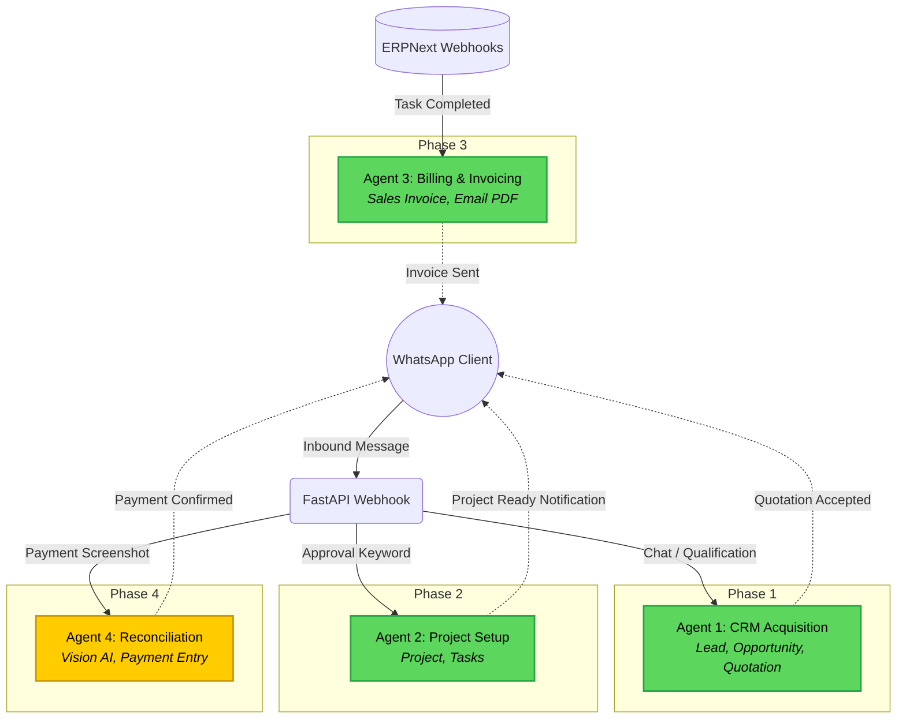

# Autonomous CRM System - Agent Status

```mermaid
graph TD
    classDef completed fill:#5cd65c,stroke:#28a745,stroke-width:2px,color:#000000;
    classDef pending fill:#ffcc00,stroke:#cc9900,stroke-width:2px,color:#000000;

    Client((WhatsApp Client))

    subgraph Phase 1
        Agent1[Agent 1: CRM Acquisition<br/><i>Lead, Opportunity, Quotation</i>]:::completed
    end

    subgraph Phase 2
        Agent2[Agent 2: Project Setup<br/><i>Project, Tasks</i>]:::completed
    end

    subgraph Phase 3
        Agent3[Agent 3: Billing & Invoicing<br/><i>Sales Invoice, Email PDF</i>]:::completed
    end

    subgraph Phase 4
        Agent4[Agent 4: Reconciliation<br/><i>Vision AI, Payment Entry</i>]:::pending
    end

    Client -->|Inbound Message| Webhook(FastAPI Webhook)
    
    Webhook -->|Chat / Qualification| Agent1
    Agent1 -.->|Quotation Accepted| Client

    Webhook -->|Approval Keyword| Agent2
    Agent2 -.->|Project Ready Notification| Client

    ERPNext[(ERPNext Webhooks)] -->|Task Completed| Agent3
    Agent3 -.->|Invoice Sent| Client

    Webhook -->|Payment Screenshot| Agent4
    Agent4 -.->|Payment Confirmed| Client
```

### Legend
* **Green:** Completed
* **Yellow:** Yet to complete
